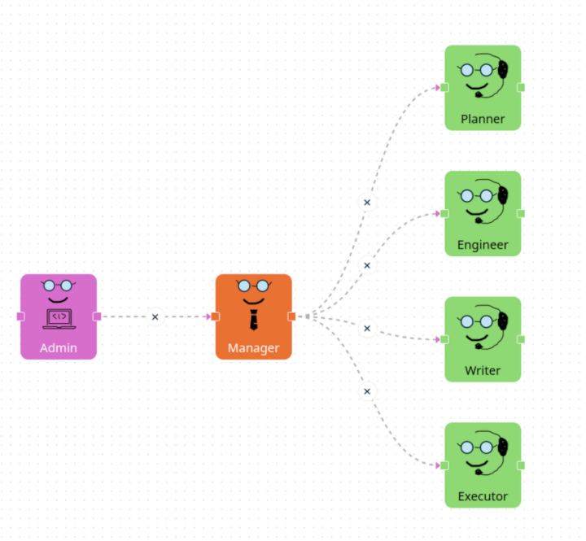

# Waldiez

 [](https://coveralls.io/github/waldiez/py)

Translate a Waldiez flow:

[](./docs/flow.png)

To a python script or a jupyter notebook with the corresponding [pyautogen](https://github.com/microsoft/autogen/) agents and chats.

## Features

- Export .waldiez flows to .py or .ipynb
- Run a .waldiez flow
- Include a `logs` folder with the logs of the flow in csv format
- Provide a custom [IOSStream](https://autogen-ai.github.io/autogen/docs/reference/io/base#iostream) to handle input and output.

## Installation

<!-- 
On PyPI:

```bash
python -m pip install waldiez
``` -->

From this repository:

```bash
python -m pip install git+https://github.com/waldiez/py.git
```

## Usage

### CLI

```bash
# Export a Waldiez flow to a python script or a jupyter notebook
waldiez --export /path/to/a/flow.waldiez --output /path/to/an/output[.py|.ipynb]
# Export and run the script, optionally force generation if the output file already exists
waldiez /path/to/a/flow.waldiez --output /path/to/an/output[.py] [--force]
```

### As a library

```python

# Export a Waldiez flow to a python script or a jupyter notebook
from waldiez import WaldieExporter
flow_path = "/path/to/a/flow.waldiez"
output_path = "/path/to/an/output.py"
exporter = WaldieExporter.load(flow_path)
exporter.export(output_path)

# Run the flow
from waldiez import WaldieRunner
runner = WaldieRunner.load(flow_path)
runner.run(output_path=output_path)

```

### Tools

- [pyautogen](https://github.com/microsoft/autogen/)
- [juptytext](https://github.com/mwouts/jupytext)
- [twisted](https://github.com/twisted/twisted)
- [pydantic](https://github.com/pydantic/pydantic)

## License

This project is licensed under the MIT License - see the [LICENSE](LICENSE) file for details.
